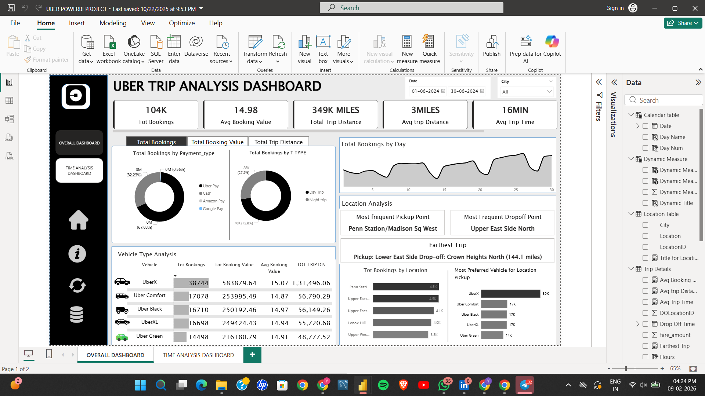

# Uber-Trip-Analysis-Dashboard
Power BI project for Uber Trip Analysis

## Project Overview
This project analyzes Uber trip data using Power BI to understand trip patterns, demand trends, and operational insights. The dashboard provides interactive visualizations to help analyze trips based on time, location, and trip frequency.

## Objective
- Analyze overall trip volume and trends
- Identify peak hours and high-demand days
- Understand trip distribution across locations
- Support data-driven decision-making for ride demand planning

## Dataset Description
The dataset includes the following fields:
- Trip ID
- Pickup Date
- Pickup Time
- Pickup Location
- Drop Location
- Trip Distance
- Number of Trips
- Day of Week
- Hour of Day

## Key Metrics (KPIs)
- Total Trips
- Trips per Day
- Trips per Hour
- Peak Hour Trips
- Average Trips per Day

## Dashboard Features
- Hour-wise and day-wise trip analysis
- Heatmap showing trip frequency by time
- Location-based trip distribution
- Trend analysis of trips over time
- Interactive slicers for date and time filtering

## Tools & Technologies
- Power BI
- Excel / CSV dataset
- Power Query for data cleaning
- DAX for calculated measures

## Insights Generated
- Identified peak demand hours during the day
- Observed higher trip volumes on specific weekdays
- Detected time slots with low trip activity
- Understood trip patterns across locations

(Dashboard 2.png)

## Business Use Cases
- Helps optimize driver availability
- Supports demand forecasting
- Assists in surge pricing and operational planning

## Conclusion
This dashboard transforms raw Uber trip data into meaningful insights using Power BI, enabling better understanding of ride demand patterns and time-based trends.
